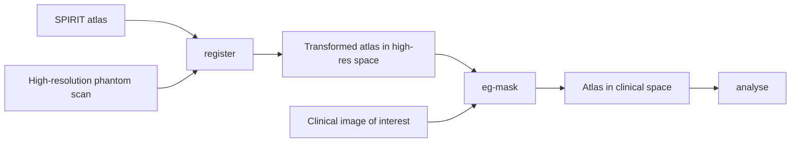

# Spirit Phantom library

Tools for analysing Gold Standard Phantoms (GSP) SPIRIT phantom data.

Typical use is a three-stage pipeline: register the SPIRIT atlas to a high-resolution phantom scan, transfer those labels onto a clinical image of interest, then analyse using the atlas in that image's space.



If you only have one scan, `register` already puts the atlas in that image's space and you can analyse immediately (for example `analyse vial-measurements`). Use `analyse eg-mask` when the scan you care about is a different grid, such as a multi-echo thermometry series.

## What you can do

- Register a scanner image and measure vials — CLI (`register`, `analyse vial-measurements`)
- NEMA slice thickness — Python API only (no CLI yet)
- Thermometry — in development (ethylene glycol mask helpers exist; no temperature analysis yet)

## Installation

`spirit-phantom` supports Python 3.11–3.13. It is not published to a package index yet; install from GitHub with [uv](https://github.com/astral-sh/uv):

```bash
uv venv .venv --python=3.12
uv pip install 'git+https://github.com/gold-standard-phantoms/spirit-phantom'
```

## Command line

List commands and options:

```bash
uv run spirit-phantom --help
uv run spirit-phantom register --help
uv run spirit-phantom analyse --help
```

Register the default SPIRIT atlas to a high-resolution scanner image, then measure vials and write checkerboard quality-control images:

```bash
uv run spirit-phantom register \
  path/to/scanner_image.nii.gz \
  --analyse vial-measurements \
  --generate-checkerboards
```

Run a standalone analysis on an already registered component atlas:

```bash
uv run spirit-phantom analyse vial-measurements \
  path/to/registration_output/transformed_component_atlas.nii.gz \
  path/to/scanner_image.nii.gz
```

Full command reference: [CLI usage](docs/cli.md).

## Documentation

Narrative guides are ordinary Markdown and can be read on GitHub:

- [CLI usage](docs/cli.md)
- [Python API usage](docs/python-api.md)
- [Developer tools](docs/developer-tools.md)

The full site (search, theme, and live API docstrings) needs MkDocs. From a clone of this repository:

```bash
uv sync
uv run mkdocs serve
```

Then open [http://127.0.0.1:8000/](http://127.0.0.1:8000/). `uv sync` is required because MkDocs is a development dependency; `uv pip install` from git does not include it.

Hosted documentation (after GitHub Pages is enabled): [https://gold-standard-phantoms.github.io/spirit-phantom/](https://gold-standard-phantoms.github.io/spirit-phantom/)

## Development

From a clone:

```bash
uv sync
uv run pytest
```

See [Developer tools](docs/developer-tools.md) for linting, type checking, Dice scoring, and other QC helpers.
