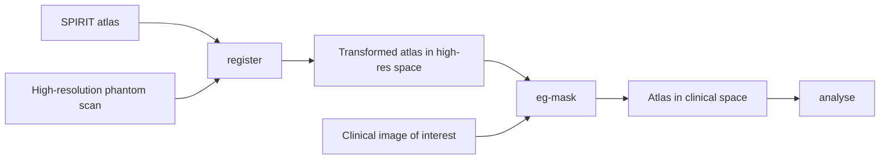

# GSP Spirit phantom tools

Tools for analysing Gold Standard Phantoms (GSP) SPIRIT phantom data.

Typical use is a three-stage pipeline: register the SPIRIT atlas to a high-resolution phantom scan, transfer those labels onto a clinical image of interest, then analyse using the atlas in that image's space.



If you only have one scan, `register` already puts the atlas in that image's space and you can analyse immediately (for example `analyse vial-measurements`). Use `analyse eg-mask` when the scan you care about is a different grid, such as a multi-echo thermometry series.

## What you can do

- Register a scanner image and measure vials — CLI (`register`, `analyse vial-measurements`)
- NEMA slice thickness — Python API only (no CLI yet)
- Thermometry — in development (ethylene glycol mask helpers exist; no temperature analysis yet)

## Guides

- [CLI usage](cli.md)
- [Python API usage](python-api.md)
- [Developer tools](developer-tools.md)

API docstrings are collected under [API reference](api/index.md). Those pages need MkDocs to expand; they are not useful as raw GitHub Markdown.

## How to read these docs

**On GitHub, no server.** The CLI, Python API, and developer-tools pages are ordinary Markdown. Follow the links above from the repository.

**Full site (search, theme, live API docstrings).** From a clone:

```bash
uv sync
uv run mkdocs serve
```

Then open [http://127.0.0.1:8000/](http://127.0.0.1:8000/). `uv sync` is required because MkDocs is a development dependency.

**Hosted.** After GitHub Pages is enabled: [https://gold-standard-phantoms.github.io/spirit-phantom/](https://gold-standard-phantoms.github.io/spirit-phantom/)
